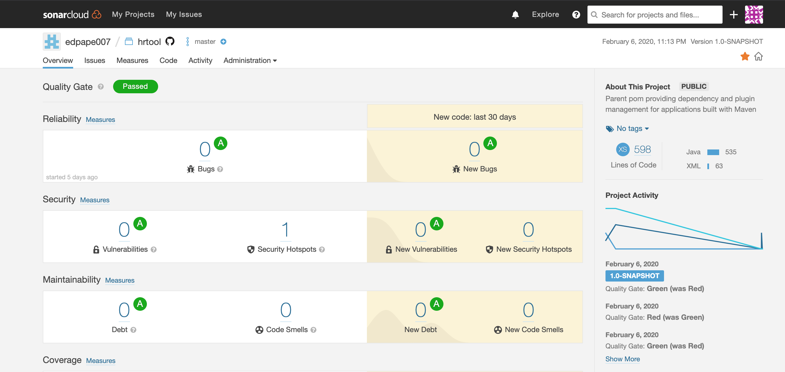

# Human Resource Tool

A small application to a human resource area.

## Description 

The objective of the application is that managers can write objectives to their employees and then qualify them.

Also that employees can give a qualitative qualification (a short description) of how their boss is towards them.

This is useful for human resources areas to obtain feedback from both the employee and their bosses and thus be able to make correction or improvement decisions.

## 1. UML

#### Boss

This is the flow for the boss process:

#### Employee

This is the flow for the employee process:

Second part of the flow:

## 2. Metrics

At the beginning, SONARQUBE was used to perform the metrics, but since it was a direct installation on my computer, it was difficult to share the results in this document, so I decided to switch to SONARCLOUD which is a solution in the cloud and allowed me to easily share the results of my metrics.

Here you can see the metrics of my project : 

This is a summary:

## 3. Clean Code

In this section the following recommendations were used: [CheatSheet](Documents/CleanCode_CheatSheet.rst) 

Together with these recommendations and metrics, several concepts of the "Clean Code" could be applied

Throughout the project you can see the concepts applied but below are specific examples:

  a. Keep it simple --> In all classes it was kept simple as for example "EmployeeService.java" where everything is easy to                           understand. 
 
  b. Use dependency injection. --> In the constructor of the following class [Constructor](      https://github.com/edpape007/App_Hr_Tool/blob/a76c1de89dd7336d26f0149b1a0ef637121943a3/src/main/java/com/hrtool/service/EmployeeService.java#L32)

  c. Be consistent --> In the folder [Repository](src/main/java/com/hrtool/repository/) all the classes follow the same                              contract (or interface)

  d. Use explanatory variables --> [Variables]( https://github.com/edpape007/App_Hr_Tool/blob/a76c1de89dd7336d26f0149b1a0ef637121943a3/src/main/java/com/hrtool/service/EmployeeService.java#L68)

  e. Function rules --> Every function is simple, small and do one thing like for [example]( https://github.com/edpape007/App_Hr_Tool/blob/a76c1de89dd7336d26f0149b1a0ef637121943a3/src/main/java/com/hrtool/service/EmployeeService.java#L55)

  f. Comment rules --> In order to create the documentation of the app are comment in every method with a little explanation                          of the main objective. Like for example: 
  
   Also here is the link of the documentation generated by ApiDocs: [HtmlDocumentation](Documents/apidocs/index.html)

  g. Structure --> This part is complementary to the functional programming that is later in the document.

  h. Tests --> There is a class dedicated to the [tests](src/test/java/com/hrtool/service/EmployeeServiceTest.java)

## 4. Build Management

MAVEN was used for this project due to its excellent integration with the java. MAVEN use POM(Project Object Model) and is the fundamental unit of work in Maven. POM is an XML file that contains information about the project and configuration details used by Maven to build the project.

Here you can find the [Pom](pom.xml) file, to see the configuration used in this project.

Another reason why MAVE was selected is because Intellij IDEA has excellent integration, facilitating user use with a graphical interface.

## 5. Testing

Unit tests are contained in the [Test](src/test/java/com/hrtool) directory.

Test Folder:

Test Results:

And to test the code and that its functionality was successful, "Spring Boot" was used, which is a framework that according to its webpage "Spring Boot makes it easy to create stand-alone, production-grade Spring based Applications that you can" just run " . " https://spring.io/projects/spring-boot

It consists of GET - POST - PUT methods that serve to test the methods and functions that were created for the application.

To test them, the POSTMAN application was used, which has a user-friendly graphic interface to perform these tests.

I.E.: 

## 6. Continuous Delivery

JENKINS was used for this project, in order to use JENKINS it was created a file with the pipeline instructions. you can find the file here: [Jenkins_Pipeline](Jenkinsfile)  

Once we already configure this file we can execute the pipeline and this is the result: 

In the previous image we can see that the pipeline is working properly and finish the deployment correctly.

## 7. IDE

The IDE "IntelliJ IDEA" was used for this project because of its versatility and the possibility of integrating plugins in a simple way.

The commands below are for Mac OS:

  - Ctrl + space bar --> to autocomplete or show the available options.
  - Cmd + R --> to run the project
  - Cmd + Fn + F2 --> to stop the running project
  - Alt + Cmd + K --> commit and push to github 
  - Ctrl + Tab --> File Switcher

## 8. DSL

-----------

employeeservice -->   associate --> creamos un lenguaje para crear objetos de tipo employee de forma flexible 

-----------

(Mostly) side effect free functions https://github.com/edpape007/App_Hr_Tool/blob/493d331265b50db21f730c4f4d7cbeea28f9d4b1/src/main/java/com/hrtool/service/EmployeeService.java#L101

Use of higher order functions: Functions as parameters and return values --> https://github.com/edpape007/App_Hr_Tool/blob/493d331265b50db21f730c4f4d7cbeea28f9d4b1/src/main/java/com/hrtool/service/EmployeeService.java#L124 --> la function collect se le entrega otra function tolist para recoger todos los items que estan en el stream y guardarlos en una lista 

anonymus function --> funciones que no tienen un nombre que se ejecutan en el momento que son creadas --> https://github.com/edpape007/App_Hr_Tool/blob/493d331265b50db21f730c4f4d7cbeea28f9d4b1/src/main/java/com/hrtool/service/EmployeeService.java#L124 --> utilizando un filtro que ejecuta una funciont que devuelve un boolean 

## 9. Functional Programming 

1. Only Final Data Structures
   
   You can find the definition of an employee (or boss because both are employees the difference is the relation between them)    in the class [Employee.java](src/main/java/com/hrtool/model/Employee.java)
   
   
